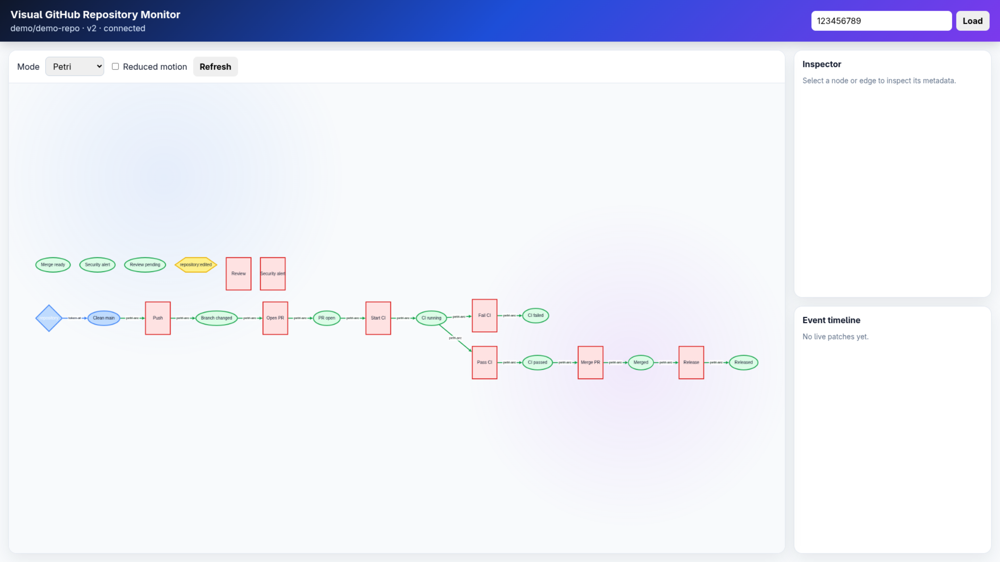
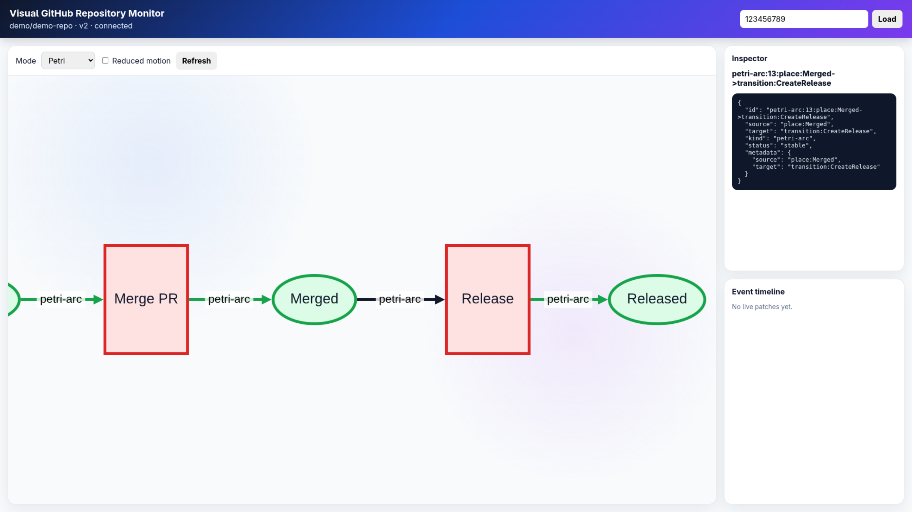

# Live Visual Monitoring System for GitHub Repository

Again this project is a protoptype under construction. And **please be careful with github-app-private-key!**

A Real Time Visual Monitoring System for your GitHub Repository, using:

- **Go** for GitHub App webhook ingestion, repository hydration, persistence, queueing, and realtime APIs.
- **Julia** for compiling repository snapshots/events into compositional wiring/string-diagram-style models and Petri-net-style activity models, using AlgebraicJulia.
- **React & Cytoscape.js & ELK** for animated browser visualization.

The system receives GitHub webhooks, deduplicates deliveries, persists normalized events, hydrates repository snapshots, extracts repository structure/dependencies, calls a Julia modeler, stores versioned visualization models, and streams patches to the dashboard.

## Layout

```text
apps/
  go-monitor/       Go services: webhook-gateway, repo-worker, realtime-api
  julia-modeler/    Julia model compiler service
  frontend/         React/Cytoscape dashboard
db/migrations/      PostgreSQL schema
deploy/             Dockerfiles
docs/               Architecture and contracts
scripts/            Demo/dev helpers
```


## Demo Visualizations
<table>
<tr>
<td></td>
<td></td>
<!-- <td></td>
</tr>
<tr>
<td></td>
<td></td> -->
</tr>
</table>


## Local deployment on Redhat/Fedora Linux: 

```bash
cp .env.example .env
# Fedora / Podman users can run the same flow with `podman compose`.
# Fill GitHub App credentials in .env, then:
docker compose up --build
```

Services:

| Service | URL |
|---|---|
| Webhook gateway | `http://localhost:8080/webhooks/github` |
| Realtime API | `http://localhost:8082` |
| Julia modeler | `http://localhost:8090` |
| Frontend | `http://localhost:5173` |
| NATS monitor | `http://localhost:8222` |
| Postgres | `localhost:5432` |

### Fedora hybrid development

On Fedora systems with Podman, the recommended local path is:

- `podman compose up -d postgres nats julia-modeler`
- `make go-bootstrap`
- `bash scripts/run_native_go_service.sh webhook-gateway`
- `bash scripts/run_native_go_service.sh repo-worker`
- `bash scripts/run_native_go_service.sh realtime-api`
- `bash scripts/fedora_hybrid_smoke_test.sh`

Full instructions are in:

```text
docs/fedora-hybrid-dev.md
```

## GitHub App settings

Initial permissions:

| Permission | Access |
|---|---|
| Contents | Read-only |
| Metadata | Read-only |
| Pull requests | Read-only |
| Checks | Read-only |
| Actions | Read-only |
| Issues | Read-only, optional |

Subscribe to these webhook events first:

```text
push
pull_request
pull_request_review
check_run
check_suite
workflow_run
release
repository
issues
issue_comment
```

Put the private key at `./secrets/github-app-private-key.pem` or update `GITHUB_PRIVATE_KEY_PATH`.


## Operations and testing manual

A detailed operations, packaging, deployment, and testing guide is available at:

```text
docs/operations-and-testing.md
```

## Some Notes

The Julia service imports Catlab and AlgebraicPetri and emits stable JSON contracts that mirror Catlab wiring diagrams and AlgebraicPetri nets. This avoids coupling the browser/Go services to internal Julia package APIs while keeping the algebraic computation layer in Julia.

